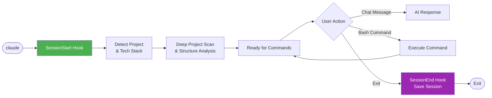

# 🎼 Maestro

> **AI Development Orchestrator** - Transform Claude into a powerful development team with specialized agents, intelligent skills, and automated workflows.

[](#-agents)
[](#-skills)
[](#-commands)
[](#-scripts)

---

## ✨ Features

- 🤖 **17 Specialized Agents** - Expert AI personas for frontend, backend, test engineering, security, and more
- 📚 **78 Skills** - Domain knowledge resources with patterns, best practices, and templates
- ⚡ **10 Slash Commands** - Quick actions for creating, orchestrating, debugging, testing, and deploying
- 🐍 **8 Python Scripts** - Automation hooks, AI-controlled quality audit & [NEW] Visual Dashboard
- 🎯 **Clean Code Standards** - CRITICAL skill for concise, direct, solution-focused code
- 🎭 **6 Behavioral Modes** - Adaptive AI behavior: Brainstorm, Implement, Debug, Review, Teach, Ship
- 🔄 **Project Detection** - Automatically detects project type and tech stack
- 🧩 **Native Agent Orchestration** - Coordinate multiple agents using Claude Code's Agent Tool
- 🧠 **Synthesis Reporting** - Automatically combines multi-agent outputs into cohesive reports

---

## 📦 Installation

Maestro supports **Windows, macOS, and Linux** with automated cross-platform installation.

### Prerequisites

- Python 3.10+
- Node.js 23+ (for native TypeScript & SQLite support)
- Claude Code or compatible AI assistant

### Quick Install

```bash
# Clone the repository
git clone https://github.com/xenitV1/claude-code-maestro.git
cd claude-code-maestro

# Install dependencies and setup
make install

# Verify installation
make verify
```

The installer will:
- ✅ Detect your operating system automatically
- ✅ Install Python dependencies (rich, pydantic)
- ✅ Copy scripts to `~/.claude/scripts/`
- ✅ Install platform-specific settings to `~/.claude/settings.json`
- ✅ Create data directories

### Platform-Specific Settings

The framework uses different settings files for each platform:

| Platform | Settings File | Python Command | Path Format |
|----------|--------------|----------------|-------------|
| **macOS/Linux** | `settings.example.unix.json` | `python3` | `~/.claude/` |
| **Windows** | `settings.example.windows.json` | `python` | `%USERPROFILE%\.claude\` |

Settings are automatically selected during installation based on your OS.

### Manual Installation

If you prefer manual setup or don't have `make`:

```bash
# Install Python dependencies
pip install rich pydantic

# Run interactive setup
python scripts/setup.py

# Or quick install (no prompts)
python scripts/setup.py --quick
```

### Verify Installation

```bash
# Check installation status
make verify

# Or manually
claude --debug
```

Look for `Found 1 hook matchers` in the debug output.

### Troubleshooting

If hooks aren't working, see **[HOOKS-TROUBLESHOOTING.md](HOOKS-TROUBLESHOOTING.md)** for detailed solutions.

---

## 🚀 Quick Start

### Create an Application

```bash
/create e-commerce site with product listing and cart
```

The framework will:
1. Analyze your request
2. Plan the project structure
3. Coordinate specialized agents
4. Generate production-ready code
5. Start a preview server

### Add Features

```bash
/enhance add dark mode
/enhance build admin panel
```

### Other Commands

```bash
/brainstorm authentication options    # Explore ideas
/debug login not working              # Investigate issues
/test user service                    # Generate tests
/deploy production                    # Deploy safely
```

---

## 📁 Project Structure

```
maestro/
├── agents/              # 17 specialized AI agents
│   ├── frontend-specialist.md
│   ├── backend-specialist.md
│   ├── mobile-developer.md
│   ├── devops-engineer.md
│   └── ...
├── skills/              # 69 knowledge resources
│   ├── app-builder/
│   ├── behavioral-modes/
│   ├── react-patterns/
│   ├── templates/
│   │   ├── nextjs-fullstack/
│   │   ├── express-api/
│   │   ├── react-native-app/
│   │   └── nextjs-static/
│   └── ...
├── commands/            # 10 slash commands
│   ├── create.md
│   ├── enhance.md
│   ├── orchestrate.md
│   ├── debug.md
│   └── ...
├── scripts/             # 8 Python automation scripts
│   ├── session_hooks.py
│   ├── explorer_helper.py
│   ├── lint_check.py        # 🆕 AI-controlled quality audit
│   ├── dependency_scanner.py
│   ├── session_manager.py
│   ├── auto_preview.py
│   ├── setup.py
│   └── README.md
├── data/                # Runtime state
├── settings.json        # Hook configuration
├── CLAUDE.md           # AI behavior configuration
└── README.md           # This file
```

---

## 🔄 Hook System Flow

The framework uses an intelligent hook system that automatically detects projects and manages sessions:



**Key Features:**
- 🔍 **Auto-Detection:** Finds your project type (Next.js, React Native, Python, etc.)
- 📊 **Project Context:** Remembers each project separately
- 🔍 **Deep Discovery:** Scans project structure and dependencies
- 🖥️ **OS Detection:** Detects OS and injects appropriate terminal commands

For detailed hook architecture, see **[scripts/README.md](scripts/README.md#hook-system-architecture)**.

---

## 🤖 Agents

Specialized AI agents that handle different aspects of development:

| Agent | Expertise | Lines |
|-------|-----------|-------|
| **explorer-agent** | Codebase exploration, dependency research | 210 |
| **debugger** | Root cause analysis, systematic debugging | 250+ |
| **api-designer** | REST/GraphQL, OpenAPI, API security | 521 |
| **mobile-developer** | React Native, Flutter, Expo, App Store | 278 |
| **devops-engineer** | PM2, deployment, CI/CD, rollback | 275 |
| **test-engineer** | Testing strategies, TDD, coverage | 268 |
| **security-auditor** | Security review, vulnerabilities | 229 |
| **orchestrator** | Multi-agent coordination | 209 |
| **database-architect** | Schema design, Prisma, migrations | 189 |
| **backend-specialist** | Node.js, Express, FastAPI | 187 |
| **frontend-specialist** | React, Next.js, Tailwind | 149 |
| **project-planner** | Task breakdown, planning | 140 |
| **performance-optimizer** | Performance profiling | 132 |
| **documentation-writer** | README, API docs | 98 |

Each agent includes:
- Domain expertise and best practices
- Code patterns and examples
- Review checklists
- Trigger keywords for automatic selection

---

## 📚 Skills

Knowledge resources that agents reference for domain expertise:

### 🏗️ Architecture & Patterns
- `api-patterns` - REST/GraphQL design patterns
- `react-patterns` - React component patterns
- `mobile-patterns` - Mobile development patterns (Testing, Debugging, Backend)
- `nodejs-best-practices` - Node.js 23 patterns (Native TS, SQLite)
- `nextjs-best-practices` - Next.js 15 App Router & React 19 patterns
- `frontend-design` - 2025 Design Precision (8-point grid, Golden Ratio)

### 🎨 Templates
| Template | Description | Tech Stack |
|----------|-------------|------------|
| **nextjs-fullstack** | Full-stack web app | Next.js, Prisma, TypeScript, Tailwind |
| **express-api** | REST API | Express, JWT, Zod, Prisma |
| **react-native-app** | Mobile app | Expo, React Query, Zustand |
| **nextjs-static** | Landing page | Next.js, Framer Motion, Tailwind |

### 🛠️ Operations
- `server-management` - Server administration
- `deployment-procedures` - Safe deployment
- `performance-profiling` - Performance analysis
- `systematic-debugging` - Debugging methodology
- `lint-and-validate` - 🆕 AI-controlled quality audit (ESLint, TSC, Ruff, Bandit)
- `mobile-ux-patterns` - Touch gestures, haptics, accessibility
- `mobile-design-thinking` - ⚠️ Anti-memorization, deep context analysis
- `mobile-backend` - Push notifications, offline sync, mobile API
- `mobile-testing` - Testing pyramid, E2E (Detox/Maestro), platform-specific
- `mobile-debugging` - Native vs JS debugging, Flipper, Logcat

---

## ⚡ Commands

| Command | Description | Mode |
|---------|-------------|------|
| `/create` | Create new application from natural language | IMPLEMENT |
| `/enhance` | Add features to existing app | IMPLEMENT |
| `/orchestrate` | Multi-agent coordination for complex tasks | ORCHESTRATE |
| `/brainstorm` | Structured idea exploration | BRAINSTORM |
| `/debug` | Systematic problem investigation | DEBUG |
| `/test` | Generate and run tests | IMPLEMENT |
| `/deploy` | Production deployment with safety checks | SHIP |
| `/preview` | Start/stop preview server | UTILITY |
| `/status` | Show project and agent status | UTILITY |

---

## 🐍 Scripts

Python automation scripts that provide intelligent hooks:

### Hook Scripts (Automatic)
| Script | Hook | Purpose |
|--------|------|---------|
| `session_hooks.py` | SessionStart/End | Project detection, session tracking |
| `explorer_helper.py` | SessionStart | Deep project discovery |

### Utility Scripts (Manual)
| Script | Purpose |
|--------|---------|
| `lint_check.py` | 🆕 AI-controlled quality audit (Ruff, ESLint, Security) |
| `session_manager.py` | Project state management |
| `auto_preview.py` | Preview server control |
| `dependency_scanner.py` | Dependency analysis |
| `setup.py` | Installation setup |

### Dependencies

```bash
pip install rich pydantic
```

---

## 🎭 Behavioral Modes

The framework adapts its behavior based on context:

| Mode | Trigger Keywords | Behavior |
|------|------------------|----------|
| **BRAINSTORM** | "ideas", "options", "what if" | Explore alternatives, ask questions |
| **IMPLEMENT** | "build", "create", "add" | Fast execution, production code |
| **DEBUG** | "error", "not working", "bug" | Systematic investigation |
| **REVIEW** | "review", "check", "audit" | Thorough constructive analysis |
| **TEACH** | "explain", "how does" | Educational explanations |
| **SHIP** | "deploy", "production" | Pre-flight checks, safety first |

---

## 🧠 Multi-Agent Orchestration

The framework uses **Claude Code's native Agent Tool** for multi-agent coordination:

### How It Works

1. **Task Decomposition**: Claude analyzes the task and identifies required expertise domains
2. **Agent Selection**: Appropriate agents are selected (security, backend, frontend, testing, etc.)
3. **Native Invocation**: Agents are invoked using Claude Code's built-in Agent Tool
4. **Synthesis**: Results are combined into a unified report with actionable recommendations

### Usage

**Via Slash Command:**
```bash
/orchestrate Review the authentication system from security, backend, and testing perspectives
```

**Via Direct Invocation:**
```
Use the orchestrator agent to coordinate a comprehensive review of the payment module
```

**Chaining Agents:**
```
First, use the explorer-agent to map the codebase.
Then, use the security-auditor to review vulnerabilities.
Finally, use the test-engineer to identify missing tests.
```

### Benefits

- ✅ **Single session** - All agents share context
- ✅ **AI-controlled** - Claude orchestrates, not external scripts
- ✅ **Native integration** - Works with built-in Explore, Plan agents
- ✅ **Resume support** - Can continue previous agent work
- ✅ **Context passing** - Findings flow between agents

---

## ⚙️ Configuration

Hooks are configured in `settings.json`:

```json
{
  "hooks": {
    "SessionStart": [
      {
        "matcher": "startup",
        "hooks": [{
          "type": "command",
          "command": "python scripts/session_hooks.py start"
        }]
      }
    ],
    "SessionEnd": [
      {
        "matcher": "",
        "hooks": [{
          "type": "command",
          "command": "python scripts/session_hooks.py end --silent"
        }]
      }
    ]
  }
}
```

### How Context Injection Works

**`CODEBASE.md`** is auto-generated in your project root on every session start:

| Step | Action | Purpose |
|------|--------|---------|
| 1 | Hook runs `session_hooks.py start` | Trigger on session start |
| 2 | Creates `CODEBASE.md` in project root | Reference file for you |
| 3 | Outputs content to stdout | **Claude receives context** |
| 4 | Claude reads stdout | Auto-injected project info |

> **Why project root?** Easy to find and reference. Hook stdout ensures Claude always receives context.

---

## 📊 Statistics

| Category | Count |
|----------|-------|
| Agents | 17 |
| Skills | 69 |
| Commands | 10 |
| Scripts | 7 |
| Templates | 12 |
| Behavioral Modes | 6 |
| Hook Scripts | 2 (session_hooks, explorer_helper) |

---

## 🔧 Troubleshooting

### ❌ Hooks Not Working?

If your `SessionStart` or `SessionEnd` hooks are not triggering, you likely need to add the `matcher` property to your hook configuration.

**See [HOOKS-TROUBLESHOOTING.md](HOOKS-TROUBLESHOOTING.md) for detailed solutions.**

**Quick Fix:**

❌ **Wrong (won't work):**
```json
"SessionStart": [
  {
    "command": "python script.py"
  }
]
```

✅ **Correct (will work):**
```json
"SessionStart": [
  {
    "matcher": "startup",
    "hooks": [
      {
        "type": "command",
        "command": "python script.py"
      }
    ]
  }
]
```

**Debug your hooks:**
```bash
claude --debug
```

Check the debug log at `~/.claude/debug/[session-id].txt` and look for:
- `Found 1 hook matchers` ✅ (not `Found 0` ❌)

For complete troubleshooting guide, see **[HOOKS-TROUBLESHOOTING.md](HOOKS-TROUBLESHOOTING.md)**.

---

## 📄 License

MIT License - See [LICENSE](LICENSE) for details.

---

## 🤝 Contributing

Contributions are welcome! Please read the documentation in each directory's README.md for specific guidelines.

---

<p align="center">
  <b>🎼 Maestro - Built with ❤️ for AI-assisted development</b><br/>
  <a href="https://x.com/xenit_v0">@xenit_v0</a>
</p>
