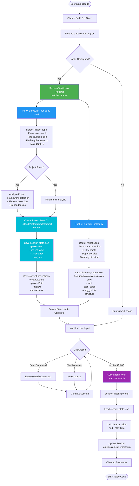

# 🐍 Maestro Scripts

Python automation scripts for hooks and utilities.

## Hook Scripts

These run automatically via `settings.json` hooks:

| Script | Hook | Purpose |
|--------|------|---------|
| [session_hooks.py](session_hooks.py) | SessionStart/End | Project detection, session tracking, dependency analysis |
| [explorer_helper.py](explorer_helper.py) | SessionStart | Deep project discovery |
| [dependency_scanner.py](dependency_scanner.py) | SessionStart | 🆕 File dependency analysis (imports, API calls) |

## Utility Scripts

| [lint_check.py](lint_check.py) | 🆕 AI-controlled quality audit (Ruff, ESLint, Security) |
| [session_manager.py](session_manager.py) | Project state management |
| [auto_preview.py](auto_preview.py) | Preview server control |
| [setup.py](setup.py) | 🆕 Cross-platform installation script |

## Usage

### Hook Scripts (automatic)
```bash
# Configured in settings.json, runs automatically
python session_hooks.py start
```

### Utility Scripts (manual)
```bash
# Session manager
python session_manager.py init --path /project --type nextjs
python session_manager.py status

# Auto preview
python auto_preview.py start
python auto_preview.py stop

# Quality Audit (AI-controlled)
python lint_check.py <file_path>
```

## Dependencies

```bash
pip install rich pydantic
```

- **rich**: Beautiful terminal output
- **pydantic**: Type-safe data models

## Data Files

Scripts read/write to `~/.claude/data/`:
- `session-stats.json` - Session metadata per project
- `current-project.json` - Global project reference
- `discovery-report.json` - Project structure analysis

---

# 🔄 Hook System Architecture

## System Flow Diagram



## 📋 Detailed Component Breakdown

### 1. SessionStart Hook (Startup)

**Triggers:** When Claude Code starts
**Scripts:**
- `session_hooks.py start --silent`
- `explorer_helper.py . --silent`

**Process:**
1. Detect current working directory
2. Recursively search for project files (depth: 3)
3. Identify framework (React Native, Next.js, Django, etc.)
4. Create project-specific data directory
5. Save session metadata
6. Scan project structure and dependencies

**Output:**
```
~/.claude/data/
├── projects/
│   └── {project-name}/
│       ├── session-stats.json
│       └── discovery-report.json
└── current-project.json
```

---

### 2. SessionEnd Hook (Exit)

**Triggers:** When user exits Claude Code
**Script:** `session_hooks.py end --silent`

**Process:**
1. Load session start time from `session-stats.json`
2. Calculate total session duration
3. Update session end timestamp
4. Output session summary (if not silent)

**Output Example:**
```
Session completed
Duration: 0:45:23
```

---

## 🗄️ Data Storage Structure

```
~/.claude/data/
├── projects/
│   ├── project-a/
│   │   ├── session-stats.json        # Session metadata
│   │   └── discovery-report.json     # Project structure
│   │
│   └── project-b/
│       ├── session-stats.json
│       └── discovery-report.json
│
├── current-project.json              # Global reference
└── hook_debug.log                    # Debug log
```

---

## 🔐 Security & Safety Features

1. **Project Isolation:** Separate data per project
2. **Silent Mode:** No user interruption
3. **Debug Logging:** Full audit trail

---

## 🎯 Key Benefits

- **Automatic Project Detection** - No manual configuration
- **Project Context** - Remembers each project separately
- **Zero User Intervention** - Runs silently in background
- **Debugging Support** - Full logging for troubleshooting

---

## 🐛 Known Limitations (Claude Code v2.0.64)

1. **SessionStart Context Issue:** Output not injected into new conversations
   - **Workaround:** Use `/clear` or `/compact` to trigger properly

2. **Hook Output Visibility:** Only visible with `--debug` flag
   - **Workaround:** Run `claude --debug` to see execution

3. **Matcher Required:** Must use `matcher` + `hooks` structure
   - **Solution:** See [HOOKS-TROUBLESHOOTING.md](HOOKS-TROUBLESHOOTING.md)

---

**Last Updated:** 2026-01-01
**Version:** 2.0
**Claude Code:** v2.0.64

